# Quiz 1 - Pemrograman Web E

5025211015 - Muhammad Daffa Ashdaqfillah

## Link and Deployment

- Github :
  [GitHub - daf2a/EF234301_WEBPRO_E_Q1_5025211015_MuhammadDaffaAshdaqfillah](https://github.com/daf2a/EF234301_WEBPRO_E_Q1_5025211015_MuhammadDaffaAshdaqfillah.git)
- Deploy Web :
  [Dashboard](https://quiz1-015.netlify.app/)

## Design

### **Computer View**

**Home Page**

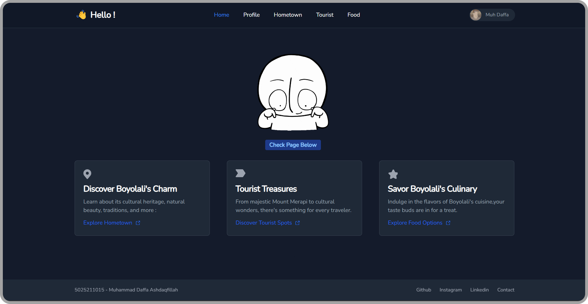

**Profile Page**

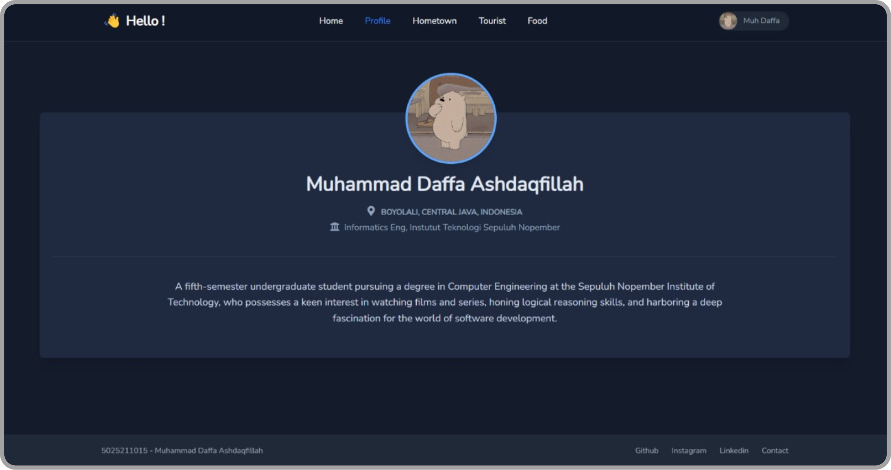

**Hometown Page**

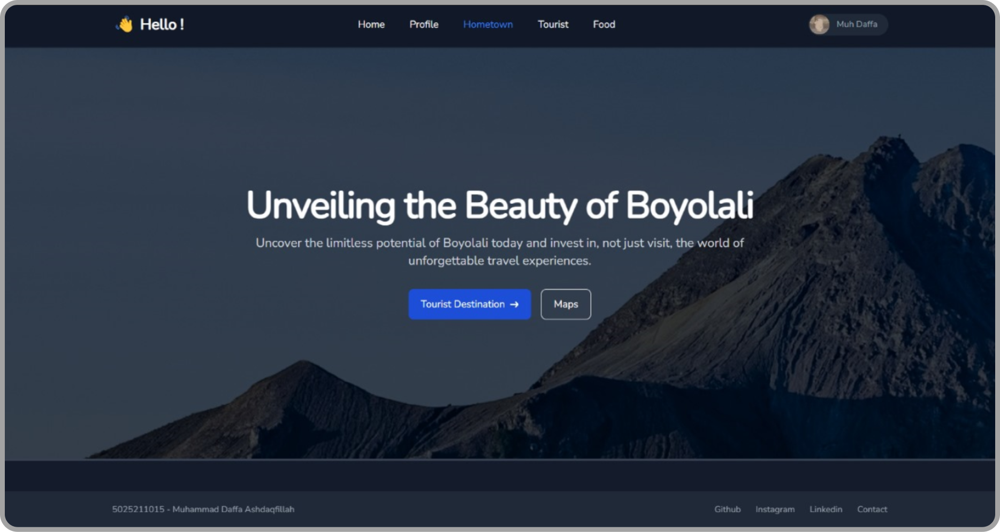

**Tourist Page**

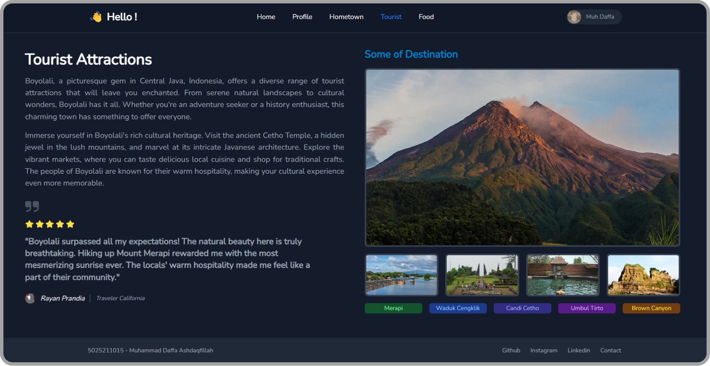

**Food Page**

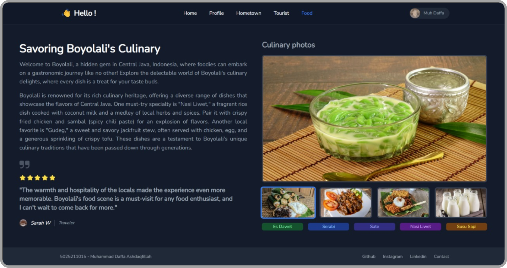

### Mobile View

**Home Page**

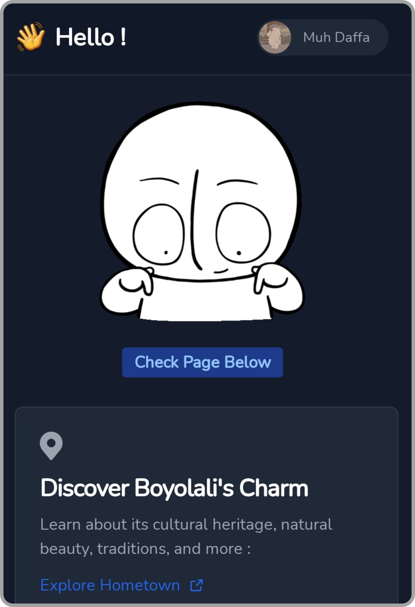

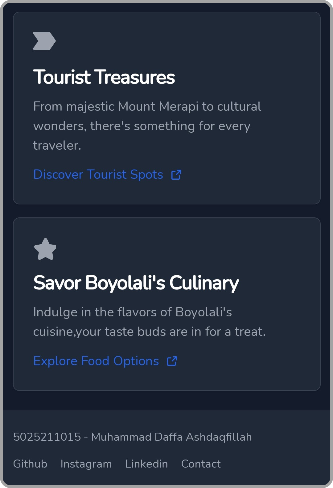

**Profile Page**


**Hometown Page**

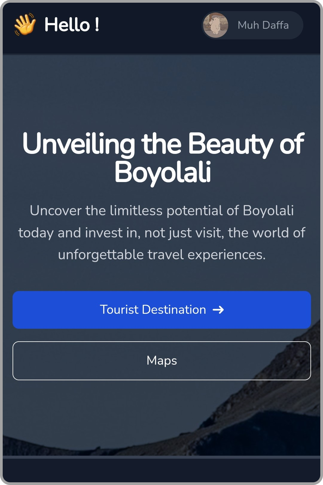

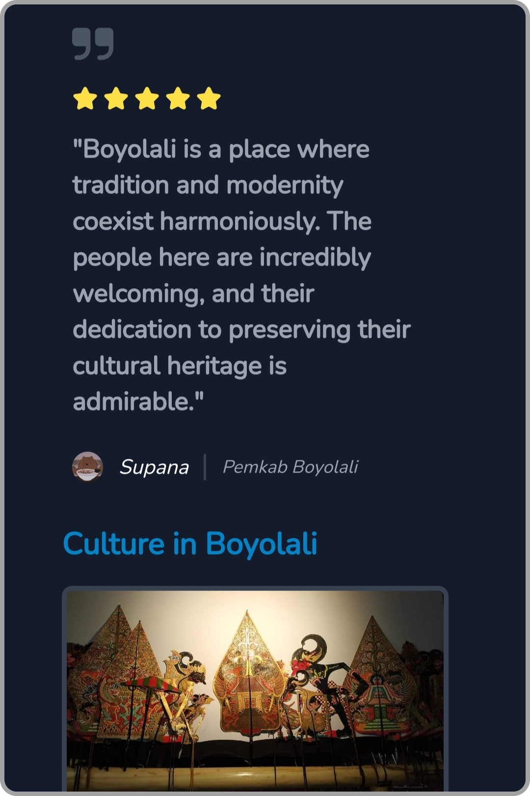

**Tourist Page**

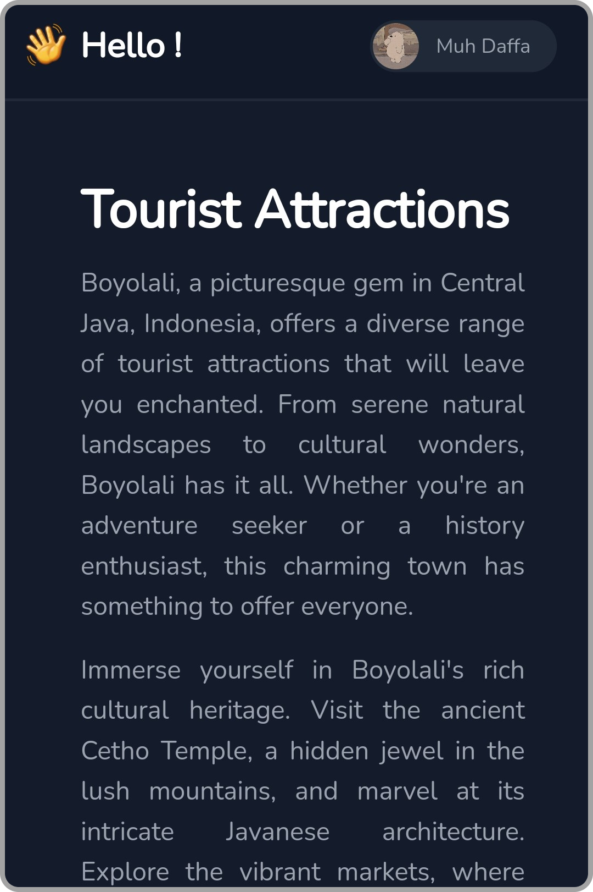

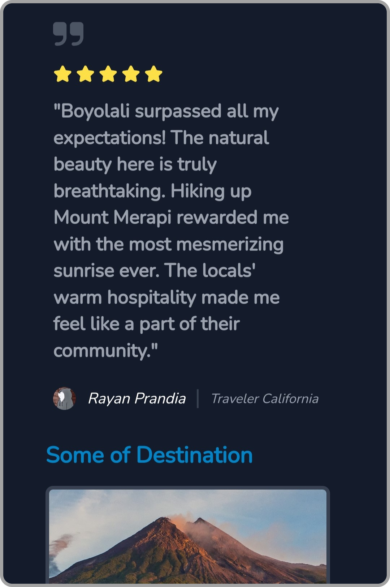

**Food Page**

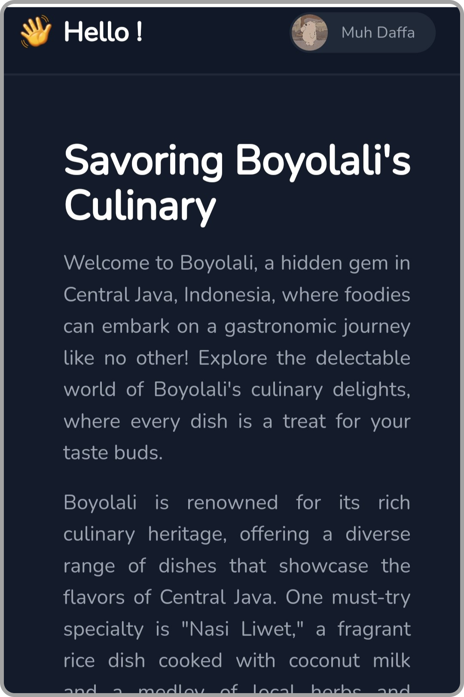

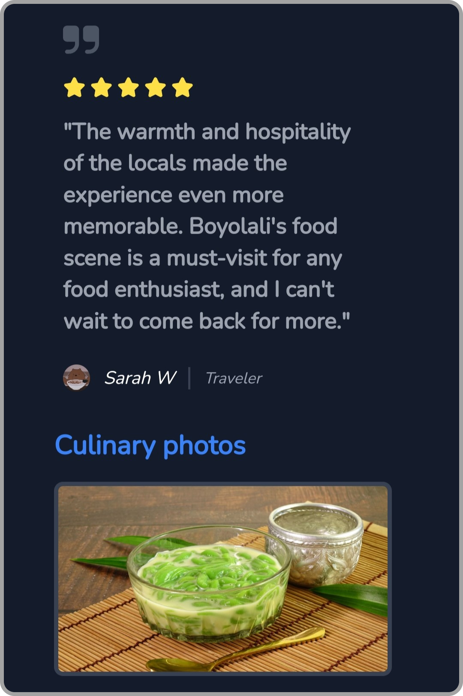

## Implementation, Analysis, Evaluation

### Framework Tailwind.js

In this quiz 1 project, I used Tailwind.js framework for assistance. Tailwind.js is a framework that greatly helps with CSS usage, such as in layouting and other aspects. This framework makes it easier for me to efficiently manage the design of web pages.

Initially, I initialized the use of this framework by using a Content Delivery Network (CDN). By using a CDN, I can easily and quickly access and utilize the features provided by Tailwind.js.

One example of using Tailwind.js with a CDN is as follows:

```html
<link
  href="<https://cdn.jsdelivr.net/npm/tailwindcss@2.2.16/dist/tailwind.min.css>"
  rel="stylesheet"
/>
```

In this project, I used several components provided by Tailwind.js, including Navbar, Footer, Button, and Card. These components make it easier for me to build web page layouts that are consistent and attractive. Furthermore, Tailwind.js also provides various layout options, such as Grid, Flex, Sticky, and Theme. By using these options, I can arrange the page layout more flexibly and according to the needs.

During the development process, I also used various methods provided by Tailwind.js, such as creating links to other pages that open in a new tab. This allows users to navigate to new pages without leaving the main page.

In conclusion, the use of Tailwind.js framework in this quiz 1 project greatly helped me in efficiently and quickly managing the design of web pages. This framework provides many features that facilitate the development process, such as ready-to-use components, flexible layout options, and methods that facilitate user interaction with the web pages.

### Component

- **Navbar**
  I use a navbar in this Quiz 1 project on every page. I set each navbar to be sticky when there is a scroll on the page. I use this navbar so that users can switch between the home, hometown, tourist, food, and profile pages. Here is the code for using the navbar in my project:
  ```jsx
  <!-- Navbar -->
      <nav
        class="bg-white border-gray-200 dark:border-gray-800 border-b-2 dark:bg-gray-900 sticky top-0 z-50"
      >
        <div
          class="max-w-screen-xl flex flex-wrap items-center justify-between mx-auto p-4"
        >
          <a href="../index.html" class="flex items-center">
            <span class="mr-2" style="font-size: 27px">👋</span>
            <span
              class="self-center text-2xl font-bold whitespace-nowrap dark:text-white"
              >Hello !</span
            >
          </a>
          <div class="flex items-center md:order-2">
            <a
              href="../profile/profile.html"
              class="flex mr-3 text-sm bg-white dark:bg-gray-800 ring-2 ring-gray-200 dark:ring-gray-800 rounded-full md:mr-0 focus:ring-4 focus:ring-gray-300 dark:focus:ring-gray-600"
              aria-expanded="false"
              data-dropdown-toggle="user-dropdown"
              data-dropdown-placement="bottom"
            >
              <span class="sr-only">Open user menu</span>
              
              <span class="text-gray-900 px-3 mt-1.5 mr-1 dark:text-gray-400"
                >Muh Daffa</span
              >
            </a>
          </div>
          <div
            class="items-center justify-between hidden w-full md:flex md:w-auto md:order-1"
            id="navbar-user"
          >
            <ul
              class="flex flex-col font-medium p-4 md:p-0 mt-4 border border-gray-100 rounded-lg bg-gray-50 md:flex-row md:space-x-10 mr-8 md:mt-0 md:border-0 md:bg-white dark:bg-gray-800 md:dark:bg-gray-900 dark:border-gray-700"
            >
              <li>
                <a
                  href="../index.html"
                  class="block py-2 pl-3 pr-4 text-gray-900 rounded hover:bg-gray-100 md:hover:bg-transparent md:hover:text-blue-700 md:p-0 dark:text-white md:dark:hover:text-blue-500 dark:hover:bg-gray-700 dark:hover:text-white md:dark:hover:bg-transparent dark:border-gray-700"
                  >Home</a
                >
              </li>
              <li>
                <a
                  href="../profile/profile.html"
                  class="block py-2 pl-3 pr-4 text-white bg-blue-700 rounded md:bg-transparent md:text-blue-700 md:p-0 md:dark:text-blue-500"
                  aria-current="page"
                  >Profile</a
                >
              </li>
              <li>
                <a
                  href="../hometown/hometown.html"
                  class="block py-2 pl-3 pr-4 text-gray-900 rounded hover:bg-gray-100 md:hover:bg-transparent md:hover:text-blue-700 md:p-0 dark:text-white md:dark:hover:text-blue-500 dark:hover:bg-gray-700 dark:hover:text-white md:dark:hover:bg-transparent dark:border-gray-700"
                  >Hometown</a
                >
              </li>
              <li>
                <a
                  href="../tourist/tourist.html"
                  class="block py-2 pl-3 pr-4 text-gray-900 rounded hover:bg-gray-100 md:hover:bg-transparent md:hover:text-blue-700 md:p-0 dark:text-white md:dark:hover:text-blue-500 dark:hover:bg-gray-700 dark:hover:text-white md:dark:hover:bg-transparent dark:border-gray-700"
                  >Tourist</a
                >
              </li>
              <li>
                <a
                  href="../food/food.html"
                  class="block py-2 pl-3 pr-4 text-gray-900 rounded hover:bg-gray-100 md:hover:bg-transparent md:hover:text-blue-700 md:p-0 dark:text-white md:dark:hover:text-blue-500 dark:hover:bg-gray-700 dark:hover:text-white md:dark:hover:bg-transparent dark:border-gray-700"
                  >Food</a
                >
              </li>
            </ul>
          </div>
        </div>
      </nav>
  ```
- **Footer**
  Besides the Navbar, I also use a Footer that is used to access my social media pages such as Github, Instagram, Linkedin, and Whatsapp. Here is the code for implementing the Footer in my project:
  ```jsx
  <!-- Footer -->
      <footer
        class="bg-white shadow fixed bottom-0 left-0 py-1 dark:bg-gray-800 w-full"
      >
        <div
          class="w-full mx-auto max-w-screen-xl p-4 md:flex md:items-center md:justify-between"
        >
          <span class="text-sm text-gray-500 sm:text-center dark:text-gray-400"
            >5025211015 - Muhammad Daffa Ashdaqfillah
          </span>
          <ul
            class="flex flex-wrap items-center mt-3 text-sm font-medium text-gray-500 dark:text-gray-400 sm:mt-0"
          >
            <li>
              <a
                href="https://github.com/daf2a"
                target="_blank"
                class="mr-4 hover:underline md:mr-6"
                >Github</a
              >
            </li>
            <li>
              <a
                href="https://instagram.com/daf2a_"
                target="_blank"
                class="mr-4 hover:underline md:mr-6"
                >Instagram</a
              >
            </li>
            <li>
              <a
                href="https://www.linkedin.com/in/muhammad-daffa-ashdaqfillah-7768b1228/"
                target="_blank"
                class="mr-4 hover:underline md:mr-6"
                >Linkedin</a
              >
            </li>
            <li>
              <a
                href="https://wa.me/6285156256501"
                target="_blank"
                class="hover:underline"
                >Contact</a
              >
            </li>
          </ul>
        </div>
      </footer>
      <!-- Footer -->
  ```
- **Button**
  In this Web Implementation, I have created several buttons on the page, such as buttons used for page navigation, switching to social media pages, or switching to maps pages. One example of Button Implementation in my project is like this:
  ```jsx
  <!-- Button -->
  <a
    href="https://www.google.com/maps?sca_esv=568877829&output=search&q=boyolali&source=lnms&entry=mc&sa=X&ved=2ahUKEwjL1ffjq8uBAxUlzTgGHSBXC8kQ0pQJegQICxAB"
    target="_blank"
    class="inline-flex justify-center hover:text-gray-900 items-center py-3 px-5 text-base font-medium text-center text-white rounded-lg border border-white hover:bg-gray-100 focus:ring-4 focus:ring-gray-400"
  >
    Maps
  </a>
  ```
- **Card**
  In the Home page, I use Cards for navigation to several other pages, which contain brief and interesting information to attract users to visit other pages. The implementation in the project is as follows:
  ```jsx
  <!-- Card 1 -->
  <div
    class="max-w-sm p-6 mx-4 bg-white border border-gray-200 rounded-lg shadow dark:bg-gray-800 dark:border-gray-700 dark:hover:bg-gray-700"
  >
    <svg
      class="w-7 h-7 text-gray-500 dark:text-gray-400 mb-3"
      aria-hidden="true"
      xmlns="http://www.w3.org/2000/svg"
      fill="currentColor"
      viewBox="0 0 20 20"
    >
      <path
        d="M8 0a7.992 7.992 0 0 0-6.583 12.535 1 1 0 0 0 .12.183l.12.146c.112.145.227.285.326.4l5.245 6.374a1 1 0 0 0 1.545-.003l5.092-6.205c.206-.222.4-.455.578-.7l.127-.155a.934.934 0 0 0 .122-.192A8.001 8.001 0 0 0 8 0Zm0 11a3 3 0 1 1 0-6 3 3 0 0 1 0 6Z"
      />
    </svg>
    <a href="hometown/hometown.html">
      <h5
        class="mb-2 text-2xl font-semibold tracking-tight text-gray-900 dark:text-white"
      >
        Discover Boyolali's Charm
      </h5>
    </a>
    <p class="mb-3 font-normal text-gray-500 dark:text-gray-400">
      Learn about its cultural heritage, natural beauty, traditions, and
      more :
    </p>
    <a
      href="hometown/hometown.html"
      class="inline-flex items-center text-blue-600 hover:underline"
    >
      Explore Hometown
      <svg
        class="w-3 h-3 ml-2.5"
        aria-hidden="true"
        xmlns="http://www.w3.org/2000/svg"
        fill="none"
        viewBox="0 0 18 18"
      >
        <path
          stroke="currentColor"
          stroke-linecap="round"
          stroke-linejoin="round"
          stroke-width="2"
          d="M15 11v4.833A1.166 1.166 0 0 1 13.833 17H2.167A1.167 1.167 0 0 1 1 15.833V4.167A1.166 1.166 0 0 1 2.167 3h4.618m4.447-2H17v5.768M9.111 8.889l7.778-7.778"
        />
      </svg>
    </a>
  </div>
  ```

### Layouting

- **Grid**
  In Layouting Card or Content, I often use Grid for object layouting, this is to facilitate the division of pages for several information. Here is an example of implementing Grid in my project:
  ```jsx
  <div class="grid gap-4 m-8 grid-cols-1 md:grid-cols-2 lg:grid-cols-2">
  ```
  This Grid also serves as a configuration if users are using a mobile phone with a different resolution screen than a laptop, so the layout can adapt.
- **Flex**
  Flex is more or less the same as grid, used to arrange content layout, but more flexible in its usage. An example of implementing Flex in my project is like this:
  ```jsx
  <div class="flex items-center md:order-2">
  ```
- **Sticky**
  I made the Navbar and Footer in this project sticky so that they always appear when the page is scrolled, allowing users to access them at any time. Here is the implementation of using sticky mode in this project:
  ```jsx
  <nav class="sticky top-0 z-50 bg-white border-gray-200 dark:border-gray-800 border-b-2 dark:bg-gray-900 sticky top-0 z-50">
  ```
  After using sticky, the position of the element will also be specified in the web. In the example above, the navbar is positioned at top-0, which is the top position of the page.
- **Theme**
  In this web modeling, I am using 2 modes that can be used, namely light mode and dark mode. This method is implemented on each element to be able to configure colors according to the user's system default theme. Here is an example of using themes in a class:

  ```jsx
  class="bg-white border-gray-200 dark:border-gray-800"
  ```

  In addition to being configured in a class, this theme customization is also based on scripts like this:

  ```jsx
  <script>
      // Fungsi untuk mengatur tema gelap
      function setThemeDark() {
        document.documentElement.setAttribute("data-theme", "dark");
        localStorage.setItem("theme", "dark");
      }

      // Cek apakah tema telah disimpan di localStorage
      const savedTheme = localStorage.getItem("theme");
      if (!savedTheme || savedTheme === "dark" || savedTheme === "light") {
        // Jika tidak ada tema yang disimpan di localStorage atau tema adalah "dark", atur tema ke gelap secara default
        setThemeDark();
      }
    </script>
  ```

### Method

- **Link to Page without Leaving Source Page**
  In this Project, I use several buttons that link to external pages such as social media and maps. Therefore, to avoid disrupting users who want to stay on the page but also want to access other pages, here the links will be opened in a new page. The implementation in the code is as follows:
  ```jsx
  <a
    href="https://instagram.com/daf2a_"
    target="_blank"
    class="mr-4 hover:underline md:mr-6"
  >
    Instagram
  </a>
  ```
- **Animation**
  I am implementing several animations when the user hovers over certain components. Here, I am using the hover method in its customization. An example of this is as follows:
  ```jsx
  class="flex mr-3 text-sm bg-white dark:bg-gray-800 ring-2 ring-gray-200 dark:ring-gray-800 rounded-full md:mr-0 focus:ring-4 focus:ring-gray-300 dark:focus:ring-gray-600"
  ```
  The result of the code is as follows:
  When not hover :
  
  When Hover :
  

### Deployment

<aside>
🌐 For website deployment, I use Netlify. Netlify is a web hosting service that provides free services for web deployment. I also deploy from my Git source.

</aside>

The result of web deployment can be accessed at the following link:

[Dashboard](https://quiz1-015.netlify.app/)

## Conclusion

In this project, I use a navbar to create an interactive navigation menu that can adapt its appearance to a dark or light theme. The footer is used to display contact information and links to social media at the bottom of the page. Buttons are used to navigate to other pages or open maps, while cards are used to display brief information that entices users to visit other pages.

In content layouting, I use grid and flex to facilitate the division of pages into various sections, and I use sticky to keep the navbar and footer visible when scrolling. The implementation of dark and light themes in this project also allows the theme to be adjusted according to the user's default system theme.

Various methods are also used in this project, such as links that open new pages and the use of hover animations on components. In addition, the deployment process uses Netlify, a free web hosting service, which facilitates the web deployment process.

Overall, by implementing various components and methods in web programming, I have made this website more interactive for users.
